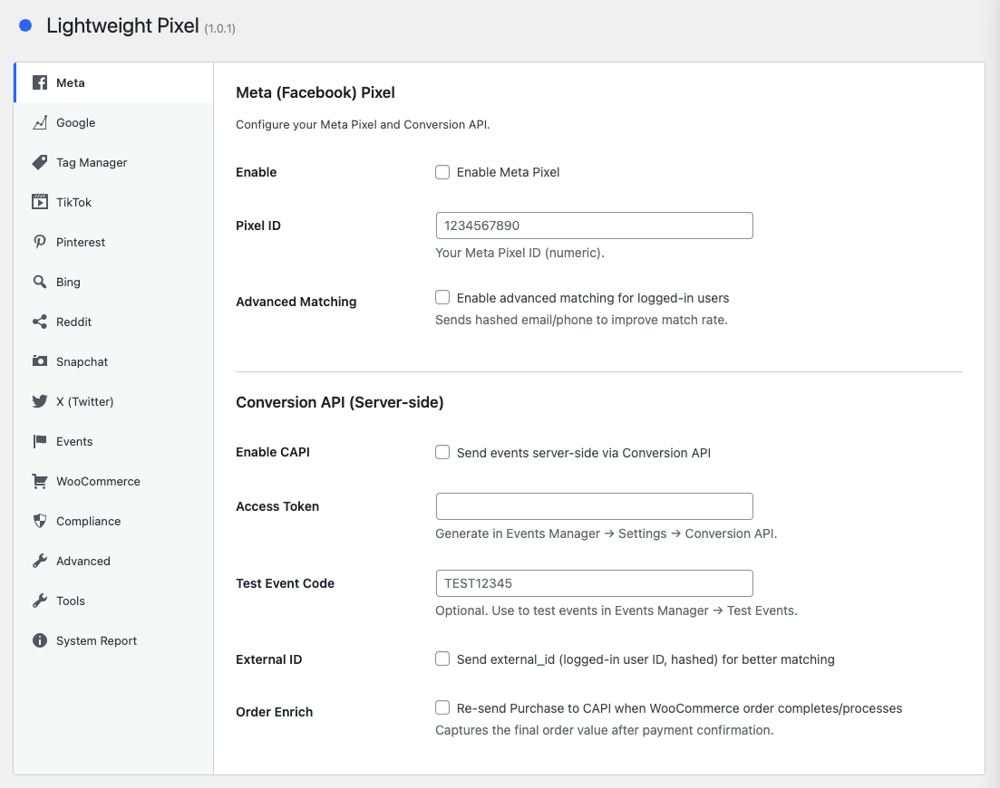

# LW Pixel

Lightweight tracking pixel manager for WordPress, with ChatGPT Ads conversion tracking from the browser and the server.

[](https://php.net)
[](https://wordpress.org)
[](https://www.gnu.org/licenses/gpl-2.0.html)
[](https://packagist.org/packages/lwplugins/lw-pixel)



## What it does

Loads tracking pixels from the major ad networks and dispatches the standard ecommerce / conversion events for them, in the browser and from your server. No upsell, no tracking, no bloat.

## ChatGPT Ads conversion tracking

- **Browser pixel** (`oaiq`) and **Conversions API** (server-side), deduplicated with a shared event ID
- **WooCommerce** — `contents_viewed`, `items_added`, `checkout_started`, `order_created` (once per order; amounts in ISO 4217 minor units)
- **Leads and signups** — form submissions as `lead_created`, new accounts as `registration_completed`; page views as `page_viewed`
- **Custom events** — your own events as `custom` with a valid `custom_event_name`
- **Consent** — marketing category via LW Cookie, for the pixel and the server-side events
- Optional SHA-256 hashed advanced matching, debug mode, `validate_only` connection test
- The API key can live in `wp-config.php`: `define( 'LW_PIXEL_CHATGPT_API_KEY', '...' );`

## Supported pixels

- **ChatGPT Ads** — `oaiq` measurement pixel + Conversions API server-side
- **Meta (Facebook) Pixel** — `fbq` browser pixel + Conversion API server-side (Advanced Matching, External ID, Order Enrich)
- **Google Analytics 4** — `gtag.js` + Measurement Protocol server-side
- **Google Ads** — conversion tracking
- **Google Tag Manager** — container + `dataLayer`
- **TikTok Pixel** — `ttq`
- **Pinterest Tag** — `pintrk`
- **Microsoft Bing UET** — `uetq`
- **Reddit Pixel** — `rdt`
- **Snapchat Pixel** — `snaptr`
- **X (Twitter) Pixel** — `twq`

## Supported events

- `PageView` (auto, every page)
- `ViewContent` — single posts/pages and WooCommerce products
- `Search` — search results pages
- `Lead` / `Contact` — form submissions
- `AddToCart`, `InitiateCheckout`, `AddPaymentInfo`, `Purchase`, `ViewCart`, `ViewCategory` — WooCommerce
- `Login`, `Signup` (CompleteRegistration), `Comment` — server-side, replayed on the next page load
- `Scroll`, `TimeOnPage`, `Download` — auto-tracked frontend events with configurable thresholds
- `Contact` (tel:/mailto: link clicks), `Lead` (thank-you page match) — auto-tracked, off by default
- Custom events — define your own with the editor (page_load / click / scroll / time triggers, URL patterns)

## Server-side events

- **Meta Conversion API** — every standard event (PageView, ViewContent, Search, Lead, Contact, AddToCart, InitiateCheckout, AddPaymentInfo, Purchase, CompleteRegistration)
- **ChatGPT Ads Conversions API** — the same events as the ChatGPT Ads pixel
- **GA4 Measurement Protocol** — the purchase; all events when GA4 is loaded by something else (e.g. Tag Manager), since GA4 does not deduplicate against `gtag.js`
- **Deduplication** — the browser and server copies share one event ID (Meta `eventID`, GA4 `event_id` parameter, ChatGPT Ads `event_id`); a purchase uses an order-based ID and is sent once per order and provider
- **Consent** — each provider's server copy follows the visitor's consent for that pixel
- **Non-blocking** — sent after the response is flushed, or in the background via Action Scheduler; nothing sent is logged
- **Cache-safe** — page-level events go server-side only on pages that a page cache cannot share between visitors

## Integrations

### Form plugins

Lead events fire automatically when any of these forms are submitted:

- **Contact Form 7**
- **WPForms**
- **Elementor Pro Forms**
- **Gravity Forms**
- **Forminator**
- **Formidable Forms**
- **Ninja Forms**
- **Fluent Forms**
- **WS Form**

### Other

- **WooCommerce** — full ecommerce funnel (ViewProduct, ViewCategory, ViewCart, AddToCart, InitiateCheckout, AddPaymentInfo, Purchase) with idempotent thank-you-page Purchase
- **LW Cookie** — granular consent-based pixel loading via `lw_cookie_is_category_allowed`
- **LW Site Manager** — managed via the Abilities API (get-options, set-options, list-pixels)

## Compliance

- **Medical traffic mode** — strips PII from event payloads and from server-side user data (Meta CAPI, ChatGPT Ads, GA4 MP) (HIPAA-friendly)
- **Limited Data Use (LDU)** — adds Meta data_processing_options for California / CCPA (auto-resolve or force California)

## Migration

Built-in **settings importer** under **LW Plugins → Pixel → Tools**: it detects a supported previous pixel plugin, shows a preview diff and imports in one click (also available as `wp lw-pixel migrate`).

## Installation

```bash
composer require lwplugins/lw-pixel
```

Or download a release ZIP from the [GitHub releases page](https://github.com/lwplugins/lw-pixel/releases).

## Configuration

After activation, go to **LW Plugins → Pixel** and add your pixel IDs. Each provider has its own settings, including its server-side options.

## License

GPL-2.0-or-later
